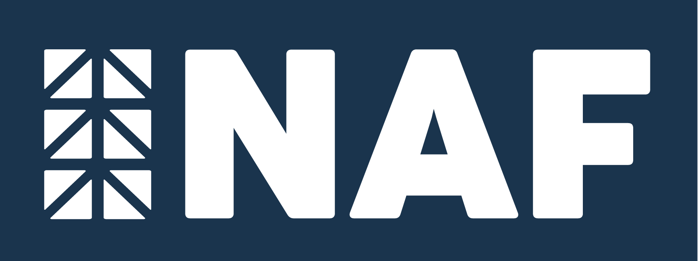

# NAF App - Frontend Repositoty
This is the frontend repository for the NAF App, a full-stack web application developed to showcase NAF’s services and projects in Argentina and the United States. The backend repository can be found ([here.](https://github.com/didonatodani/naf_backend))

### About NAF
NAF was founded in 1997 by Normando Andrés Florian, specializing in water treatment and sanitation infrastructure works. In 2022, under the leadership of Eng. Lucas Florian, NAF expanded its services to include Structural Engineering and BIM Modeling, marking the beginning of a new chapter. NAF is dedicated to innovation, sustainability, and turning clients' ideas into concrete realities.

## Technologies Used
- Frontend: React
- Backend: Node.js, Express, MongoDB (see backend repo)
- Data fetching: Axios (for fetching project data from MongoDB)
- UI Feedback: Toastify (for toasts and user feedback)
  
## Components:
- Staff Card
- Projects Card
- Navbar
- Footer
- Clients Card
- Contact Form
  
## Main Pages:
- Homepage
- About Page
- Services Page
- Projects Pages (Construction, Structural Calculation, BIM Design)
- Project Details Page
- Contact Page (includes a form that saves information in the database and sends an email to NAF)
  
## Data Management:
- Project data is fetched from a MongoDB database using Axios.
- Static information (clients, staff, and partners) is stored in JSON files in the data folder.

## Deployment:
The frontend of this project is deployed through Vercel, which provides fast and scalable hosting for web applications. You can access the live version of the app here: ([NAF App](https://naf-front.vercel.app/))

## Backlog / Future Enhancements:
- Context for different languages: Adding support for both English (US) and Spanish (Argentina) using React Context.
- Context for Color Palettes: Implementing a color palette context to reflect the branding of each project/service section.
- User Authentication: Enabling authentication for partners, allowing them to create, update, and delete projects via forms and a login system.

## Acknowledgments
I am very excited about this project, as it is my first full-scale, full-stack project. I’m progressing at my own pace, but I’m learning a lot of new things and overcoming various challenges along the way. It’s being an incredibly rewarding experience, and I look forward to continuing to build and improve it.
